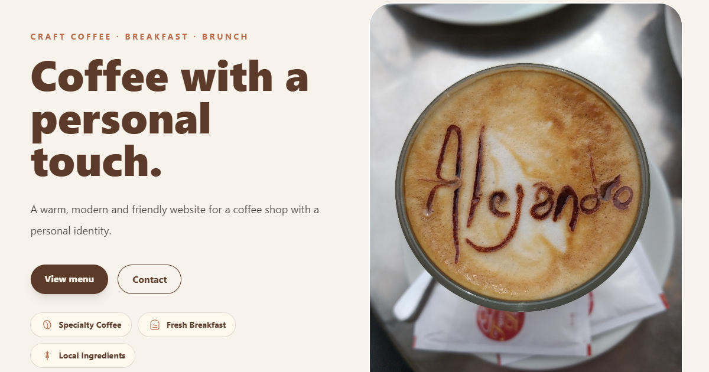

# ☕ Café Alejandro

<div align="center">

### Responsive multilingual coffee shop website built with Astro & Tailwind CSS

**A modern, responsive and multilingual coffee shop website built to showcase clean UI design, component-based architecture and front-end best practices.**

<br>


</div>

---

## 🌐 Live Demo

🔗 **https://coffee-shop-alejandro.netlify.app**

---

## 📸 Preview

<p align="center">
  
</p>

---

## 📖 Overview

**Café Alejandro** is a fictional specialty coffee shop website built with **Astro** and **Tailwind CSS**.

The project recreates the online presence of a modern café through a clean, elegant and responsive interface while applying component-based architecture, multilingual support, accessibility improvements and SEO best practices.

---

## ✨ Features

* ☕ Responsive coffee shop landing page
* 🌍 Multilingual support (Spanish, Catalan and English)
* 📱 Mobile-first responsive design
* 🧩 Component-based architecture
* 🎨 Custom SVG icon system
* ✨ Smooth animations and micro-interactions
* ♿ Semantic HTML & accessibility
* 🚀 SEO optimized
* 🖼️ Open Graph & Twitter Cards
* 🗺️ XML Sitemap
* 🤖 Robots.txt
* 📲 Web App Manifest

---

## 🛠 Tech Stack

* Astro
* Tailwind CSS
* TypeScript
* HTML5
* CSS3
* Netlify

---

## 🚀 Getting Started

Clone the repository

```bash
git clone https://github.com/alejandroarevaloprogrammer/coffee-shop.git
```

Navigate into the project

```bash
cd coffee-shop
```

Install dependencies

```bash
npm install
```

Start the development server

```bash
npm run dev
```

Create a production build

```bash
npm run build
```

---

## 🌍 SEO

This project includes:

* Canonical URLs
* hreflang support
* Open Graph metadata
* Twitter Cards
* XML Sitemap
* Robots.txt
* Web App Manifest
* Theme Color
* Optimized favicons

---

## 👨‍💻 Author

**Alejandro Arevalo Rojas**

* GitHub: https://github.com/alejandroarevaloprogrammer
* Portfolio: https://alejandroarevalorojas.com

---

## 📄 License

Distributed under the **MIT License**.

See the **LICENSE** file for more information.
